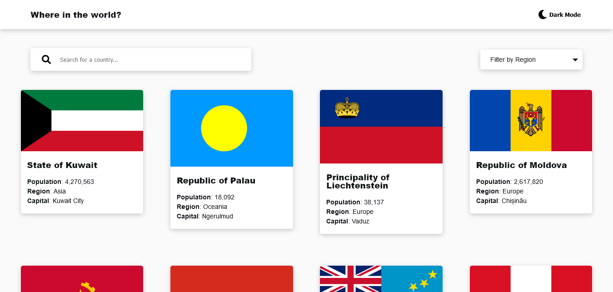

# Frontend Mentor - REST Countries API with color theme switcher solution

This is a solution to the [REST Countries API with color theme switcher challenge on Frontend Mentor](https://www.frontendmentor.io/challenges/rest-countries-api-with-color-theme-switcher-5cacc469fec04111f7b848ca). Frontend Mentor challenges help you improve your coding skills by building realistic projects. 

### The challenge

Users should be able to:

- See all countries from the API on the homepage
- Search for a country using an `input` field
- Filter countries by region
- Click on a country to see more detailed information on a separate page
- Click through to the border countries on the detail page
- Toggle the color scheme between light and dark mode *(optional)*

### Screenshot



### Built with

- Semantic HTML5 markup
- Sass custom properties
- Flexbox
- [React](https://reactjs.org/) - JS library

### What I learned
- Got familiar with navigating and sending data between pages using react-router useNavigation and useLocation hooks.

```js
navigate('/detail', {
  state: {
    name: name,
    borders: arr,
  }
})
```
- How to pass data from react childComponent to parentComponent
```jsx
<CustomSelect childToParent={childToParent} />
```


### Useful resources

- [useNavigate & useLocation](https://dev.to/cjreads665/usenavigatenavigate-and-uselocation-in-react-router-v6-lip) 

- [React Multiple Pages](https://isotropic.co/react-multiple-pages/)

- [How to pass Data and Events Between Components in React](https://www.freecodecamp.org/news/pass-data-between-components-in-react/)
